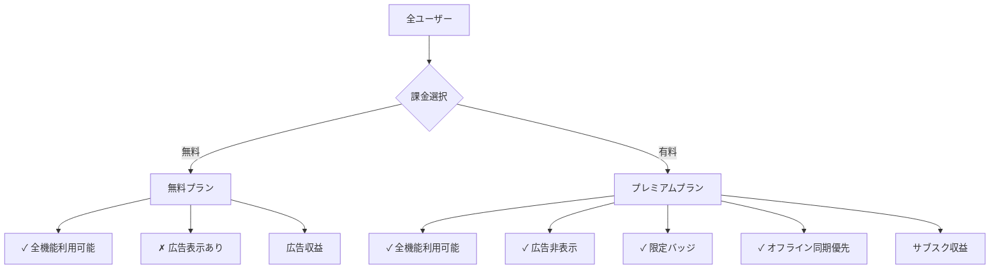
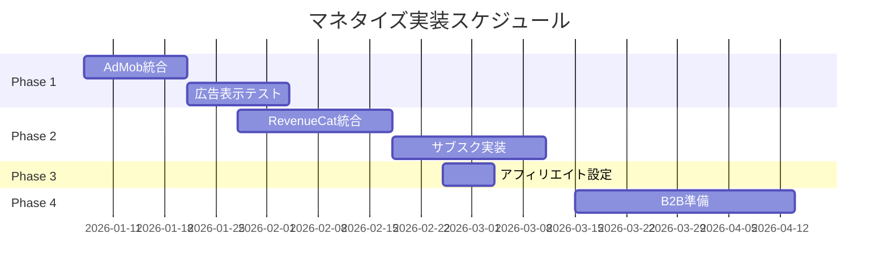

# マネタイズ戦略計画書

## エグゼクティブサマリー

本計画書は、クレーンゲーム攻略アプリの収益化戦略を定義します。MVP（Minimum Viable Product）の段階から段階的にマネタイズ機能を実装し、ユーザー体験を損なわずに収益を最大化することを目指します。

**推奨モデル:** フリーミアム + 広告ハイブリッド

**目標:**
- 3ヶ月後: 広告収益開始
- 6ヶ月後: サブスクリプション開始
- 1年後: 月間売上 27万円

---

## User Review Required

> [!IMPORTANT]
> 以下の戦略方針について確認をお願いします：
> 
> - **Phase 1優先度**: まず広告（AdMob）から実装し、収益化の基盤を構築
> - **広告表示タイミング**: ユーザー体験を損なわないよう、自然なタイミングで表示
> - **サブスクリプション価格**: 月額480円（年額4,800円で20%オフ）
> - **無料プランの制限**: 広告表示のみ。投稿や機能に制限は設けない（ユーザー獲得優先）

---

## 収益モデル概要

### フリーミアム + 広告ハイブリッドモデル



### 4つの収益源

| # | 収益源 | 優先度 | 期待収益 | 実装難易度 |
|---|--------|--------|----------|------------|
| 1 | **AdMob広告** | 高 | 中 | 低 |
| 2 | **サブスクリプション** | 高 | 高 | 中 |
| 3 | **アフィリエイト** | 中 | 低〜中 | 低 |
| 4 | **B2B提携** | 低 | 不明 | 高 |

---

## Phase 1: 広告統合（AdMob）

### 概要

Google AdMobを使用して、無料ユーザーに広告を表示します。

### 広告タイプと配置

#### 1. バナー広告
**配置場所:**
- ホーム画面（攻略法リスト）の下部
- 用語集画面の下部

**特徴:**
- 常時表示されるが、コンテンツを邪魔しない
- eCPM（1000回表示あたりの収益）: 100-300円程度

**実装:**
```dart
// ホーム画面下部にバナー広告を配置
if (!isPremium) {
  AdWidget(ad: bannerAd, key: const Key('home_banner'));
}
```

#### 2. インタースティシャル広告（フルスクリーン広告）
**配置場所:**
- バーコードスキャン結果表示後（3回に1回）
- 攻略法動画視聴後（2回に1回）

**特徴:**
- 高収益だが、ユーザー体験への影響が大きい
- eCPM: 1,000-3,000円程度
- 表示頻度を適切に管理することが重要

**実装:**
```dart
// スキャン結果表示後にカウンターをチェック
_scanCount++;
if (_scanCount % 3 == 0 && !isPremium) {
  await _interstitialAd?.show();
}
```

#### 3. リワード広告（報酬型広告）
**配置場所:**
- 「もっと詳しい攻略法を見る」ボタン
- 限定コンテンツの解放

**特徴:**
- ユーザーが能動的に視聴するため、体験を損なわない
- eCPM: 2,000-5,000円程度（最も高収益）

**実装:**
```dart
// リワード広告視聴でプレミアム機能を24時間解放
ElevatedButton(
  onPressed: () async {
    final reward = await _rewardedAd?.show();
    if (reward != null) {
      // 24時間プレミアム機能を有効化
      await _unlockPremiumFor24Hours();
    }
  },
  child: Text('広告を見て限定攻略法を解放'),
)
```

### 技術スタック

| コンポーネント | パッケージ/サービス | バージョン |
|--------------|-------------------|-----------|
| 広告SDK | `google_mobile_ads` | ^5.0.0 |
| 広告管理 | Google AdMob | - |
| テスト広告ID管理 | 環境変数 | - |

### 実装ステップ

1. **AdMob アカウントセットアップ**
   - AdMobアカウント作成
   - アプリ登録（iOS/Android）
   - 広告ユニットID取得（バナー、インタースティシャル、リワード）

2. **パッケージ導入**
   ```yaml
   dependencies:
     google_mobile_ads: ^5.0.0
   ```

3. **広告マネージャーの作成**
   - `lib/services/ad_manager.dart`
   - 広告の初期化、読み込み、表示を管理
   - テスト広告とプロダクション広告の切り替え

4. **広告表示の統合**
   - ホーム画面にバナー広告
   - スキャン結果にインタースティシャル広告
   - リワード広告ボタンの追加

5. **プレミアムユーザーの広告除外**
   - サブスクリプション状態の確認
   - 広告表示の条件分岐

### 収益予測（AdMob）

| 指標 | 3ヶ月後 | 6ヶ月後 | 1年後 |
|------|--------|--------|-------|
| DAU | 500 | 2,000 | 5,000 |
| 1日あたり広告表示回数 | 2,500 | 10,000 | 25,000 |
| 平均eCPM | ¥200 | ¥250 | ¥300 |
| 月間広告収益 | ¥15,000 | ¥75,000 | ¥225,000 |

---

## Phase 2: サブスクリプション

### 概要

RevenueCatを使用して、iOS/AndroidのアプリプラスストアのIn-App Purchase（IAP）を統一管理します。

### プレミアムプランの内容

#### 料金体系

| プラン | 価格 | 割引 |
|-------|------|------|
| **月額プラン** | ¥480/月 | - |
| **年額プラン** | ¥4,800/年 | 20%オフ |
| **無料トライアル** | 7日間 | 初回のみ |

#### 提供価値

| 機能 | 無料プラン | プレミアムプラン |
|------|----------|----------------|
| 基本機能（スキャン、投稿、検索） | ✓ | ✓ |
| 広告表示 | あり | **なし** |
| 限定バッジ/称号 | 基本のみ | **全種類** |
| オフライン同期 | なし | **優先対応** |
| 投稿の優先表示 | なし | **上位表示** |
| 新機能の先行アクセス | なし | **あり** |

> [!TIP]
> **価格設定の根拠:**
> - 競合アプリ分析: ゲーム攻略系アプリの平均価格帯は400-600円
> - ユーザー価値: 月に1-2回ゲームセンターに行くユーザーにとって、1プレイ分程度の価格
> - 心理的障壁: 500円を切る価格設定で購入ハードルを下げる

### 技術スタック

| コンポーネント | パッケージ/サービス | バージョン |
|--------------|-------------------|-----------|
| IAP管理 | `purchases_flutter` (RevenueCat) | ^8.0.0 |
| バックエンド | RevenueCat Dashboard | - |
| App Store | Apple App Store Connect | - |
| Google Play | Google Play Console | - |

### 実装ステップ

1. **RevenueCat セットアップ**
   - RevenueCatアカウント作成
   - プロジェクト作成とAPI Key取得
   - App Store Connect / Google Play Consoleとの連携

2. **In-App Purchase 商品登録**
   - App Store: 月額/年額サブスクリプション商品作成
   - Google Play: サブスクリプション商品作成
   - RevenueCatに商品IDを登録

3. **パッケージ導入**
   ```yaml
   dependencies:
     purchases_flutter: ^8.0.0
   ```

4. **サブスクリプション管理サービスの作成**
   - `lib/services/subscription_service.dart`
   - サブスクリプション状態の取得
   - 購入処理
   - 復元処理

5. **UI統合**
   - プレミアムプラン紹介画面
   - 設定画面にサブスクリプション管理
   - プレミアム限定機能のロック/アンロック

6. **広告との連携**
   - プレミアムユーザーの広告非表示
   - リワード広告での一時的なプレミアム体験

### 収益予測（サブスクリプション）

| 指標 | 6ヶ月後 | 1年後 | 2年後 |
|------|--------|-------|-------|
| MAU | 5,000 | 20,000 | 50,000 |
| 課金率 | 2% | 3% | 5% |
| 課金ユーザー数 | 100 | 600 | 2,500 |
| ARPU | ¥400 | ¥450 | ¥480 |
| 月間サブスク収益 | ¥40,000 | ¥270,000 | ¥1,200,000 |

---

## Phase 3: アフィリエイト

### 概要

景品やゲームセンター関連商品のアフィリエイトリンクを設置します。

### アフィリエイト先

#### 1. Amazon アソシエイト
**対象商品:**
- クレーンゲーム景品（フィギュア、ぬいぐるみ）
- 攻略本
- アーム強化グッズ

**実装:**
```dart
// 景品詳細画面にAmazonリンクを追加
TextButton.icon(
  icon: Icon(Icons.shopping_cart),
  label: Text('Amazonで類似商品を探す'),
  onPressed: () => launchUrl('https://amazon.co.jp/...?tag=YOUR_TAG'),
)
```

#### 2. 楽天アフィリエイト
**対象商品:**
- 景品の類似商品
- ゲームセンター関連グッズ

#### 3. A8.net
**対象サービス:**
- ゲームセンター・アミューズメント施設
- 関連サービス

### 実装ステップ

1. **アフィリエイトプログラム登録**
   - Amazon アソシエイト
   - 楽天アフィリエイト
   - A8.net

2. **アフィリエイトリンク管理**
   - `lib/config/affiliate_config.dart`
   - アフィリエイトタグの一元管理

3. **UI統合**
   - 商品詳細画面に「類似商品を探す」リンク
   - 攻略法動画に関連商品リンク

### 収益予測（アフィリエイト）

| 指標 | 6ヶ月後 | 1年後 |
|------|--------|-------|
| 月間クリック数 | 500 | 2,000 |
| コンバージョン率 | 2% | 3% |
| 平均報酬単価 | ¥200 | ¥300 |
| 月間アフィリエイト収益 | ¥2,000 | ¥18,000 |

---

## Phase 4: B2B提携（将来的）

### 概要

ゲームセンターや景品メーカーとの提携による収益化。

### 提携案

#### 1. ゲームセンター提携
**提供価値:**
- アプリ内での店舗情報掲載
- クーポン配信
- 混雑状況の表示

**収益モデル:**
- 掲載料: 月額5,000-10,000円/店舗
- クーポン配信: 1配信あたり3,000円

#### 2. 景品メーカー提携
**提供価値:**
- 新商品情報の優先配信
- 攻略法動画のスポンサー

**収益モデル:**
- 商品PR: 1商品あたり10,000-30,000円
- 動画スポンサー: 1動画あたり5,000円

### 実装ステップ

1. **ユーザーベースの構築** (MAU 10,000以上)
2. **営業資料の作成**
3. **提携先へのアプローチ**
4. **管理画面の構築** (店舗/メーカー向け)

---

## 実装ロードマップ

### タイムライン



### Phase 1: AdMob統合（2週間）

- [x] AdMobアカウント作成とアプリ登録
- [ ] `google_mobile_ads`パッケージ導入
- [ ] AdManagerサービス作成
- [ ] バナー広告実装（ホーム画面）
- [ ] インタースティシャル広告実装（スキャン結果）
- [ ] リワード広告実装（限定コンテンツ）
- [ ] テスト広告での動作確認
- [ ] プロダクション広告への切り替え

### Phase 2: サブスクリプション（3週間）

- [ ] RevenueCatアカウント作成
- [ ] App Store Connect / Google Play Consoleでの商品登録
- [ ] `purchases_flutter`パッケージ導入
- [ ] SubscriptionServiceサービス作成
- [ ] プレミアムプラン紹介画面
- [ ] 購入フロー実装
- [ ] 復元機能実装
- [ ] 広告非表示機能との連携
- [ ] サンドボックステスト

### Phase 3: アフィリエイト（1週間）

- [ ] アフィリエイトプログラム登録
- [ ] affiliate_config.dart作成
- [ ] 商品詳細にリンク追加
- [ ] アフィリエイトリンクのトラッキング

### Phase 4: B2B提携（将来的）

- [ ] ユーザーベースの構築（MAU 10,000+）
- [ ] 営業資料作成
- [ ] 提携先アプローチ

---

## リスクと対策

### リスク 1: 広告による離脱率上昇

**リスク:**
- 広告が多すぎるとユーザーが離脱

**対策:**
- 広告表示頻度の段階的な調整
- A/Bテストで最適な頻度を見つける
- Firebase Analyticsで離脱率を監視

### リスク 2: サブスクリプション登録率の低迷

**リスク:**
- プレミアムプランの価値が伝わらない

**対策:**
- 無料トライアル（7日間）の提供
- プレミアム限定バッジの追加
- ユーザーレビューでの価値訴求

### リスク 3: 収益目標未達

**リスク:**
- 想定よりもユーザー数が少ない

**対策:**
- SNSマーケティングの強化
- App Store Optimization (ASO)
- インフルエンサーとのコラボ

---

## KPI（重要業績評価指標）

### 成長指標

| 指標 | 3ヶ月後 | 6ヶ月後 | 1年後 |
|------|--------|--------|-------|
| DAU | 500 | 2,000 | 5,000 |
| MAU | 2,000 | 5,000 | 20,000 |
| 継続率（7日） | 30% | 40% | 50% |

### 収益指標

| 指標 | 3ヶ月後 | 6ヶ月後 | 1年後 |
|------|--------|--------|-------|
| 広告収益 | ¥15,000 | ¥75,000 | ¥225,000 |
| サブスク収益 | - | ¥40,000 | ¥270,000 |
| アフィリエイト収益 | - | ¥2,000 | ¥18,000 |
| **合計月間収益** | **¥15,000** | **¥117,000** | **¥513,000** |

### エンゲージメント指標

| 指標 | 目標 |
|------|------|
| セッション時間 | 5分以上 |
| スキャン回数/DAU | 2回以上 |
| 投稿率 | 10% |
| プレミアム転換率 | 3% |

---

## まとめ

### 短期（3ヶ月）
- ✅ AdMob広告統合で収益化開始
- ✅ 広告表示の最適化
- ✅ ユーザーベースの構築

### 中期（6ヶ月）
- ✅ サブスクリプション開始
- ✅ アフィリエイトリンク設置
- ✅ 月間10万円超の収益達成

### 長期（1年）
- ✅ B2B提携の開始
- ✅ 月間50万円の収益達成
- ✅ 持続可能なビジネスモデルの確立

**次のステップ:** Phase 1の実装計画を詳細化して、AdMob統合から始めましょう！
